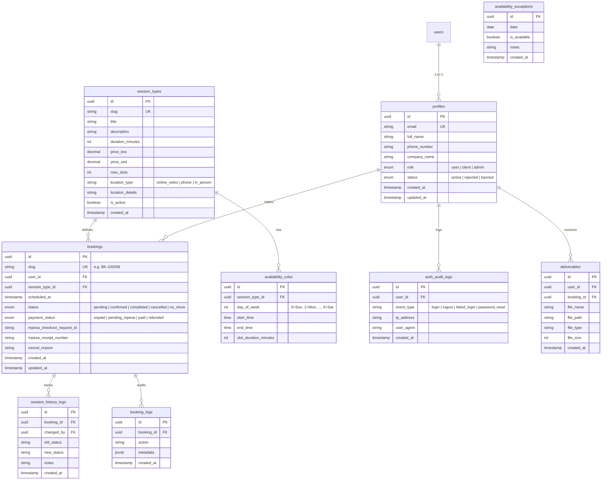

# Implementation Plan - Full Supabase Backend & Dashboard for AI Automation Booking (cillah.dev)

Adapt the booking system architecture from class to Cheryl Cilla Atulah's AI Automation Agency website (`cillah.dev`). Replace Airtable with a scalable Supabase backend (PostgreSQL database, Auth, Storage, Edge Functions) and add full Client and Admin portals with live M-Pesa Daraja payment processing.

---

## 1. Airtable vs. Supabase Architectural Decision

> [!IMPORTANT]
> **Decision:** Move 100% to **Supabase**

| Criteria | Airtable | Supabase (PostgreSQL) | Benefit for cillah.dev |
| :--- | :--- | :--- | :--- |
| **Auth & Security** | No native end-user auth or fine-grained access | Native JWT Auth & Row Level Security (RLS) policies | Clients only see their own bookings; Admin has protected full access. |
| **Scalability & Cost** | Strict rate limits (5 req/sec), high per-seat cost | Scalable PostgreSQL database with zero per-seat fees | Handles high lead spikes & payment webhooks without throttling. |
| **Payment Integration** | Requires third-party webhooks/Zapier middleware | Native API Routes / Supabase Edge Functions | Instant M-Pesa STK Push triggers & secure callback handling. |
| **Media & Assets** | Restricted attachment storage & link expiration | Supabase Storage Buckets with RLS policies | Secure hosting for client deliverables, audit reports, and media. |

---

## 2. Adaptation to cillah.dev (AI Automation Business)

In contrast to fitness training sessions, the system for `cillah.dev` supports high-value consulting and automation service sessions:

1. **Free Automation Audit (30 min):** Discovery call to identify manual operational bottlenecks in client workflows ($0).
2. **1-on-1 Strategy & Architecture Call (60 min):** Deep-dive session designing custom AI agents, CRM syncs, and workflow automations (Paid via M-Pesa).
3. **Retainer Sync & VIP Sprint Kickoff:** Ongoing client status updates and project milestones.

### User Roles & Transition Rules
- **`user`**: Default role assigned automatically upon registration.
- **`client`**: Automatically promoted from `user` when their first session booking is created and payment is confirmed.
- **`admin`**: System administrator (Cheryl Cilla Atulah) with access to full admin dashboard, dynamic session types CRUD, slot availability management, system history, reporting, and user status controls (`active`, `rejected`, `banned`).

---

## 3. Database Schema (Supabase PostgreSQL)



---

## 4. UI/UX & Page Architecture

- **Branding:** Dark mode SaaS theme (`#0F172A` Slate background, `#06B6D4` Cyan glow accents, Geist/Inter typography).
- **Toast Notifications:** Configured to display on the top-left using `sonner` (`<Toaster position="top-left" />`).
- **Navigation Pattern:** Unique URL slugs for detail views (e.g. `/client/bookings/bk-102938`, `/admin/clients/usr-98213`), using modals **exclusively** for quick confirmations and inline field edits.

### File Structure Map

```
/app
├── (auth)/
│   ├── login/page.tsx               # User & Admin Login with Audit Logger
│   ├── signup/page.tsx              # User Registration
│   ├── profile/page.tsx             # User Profile & Security Settings
│   └── logout/route.ts              # Session Termination
├── dashboard/page.tsx                # Unified Role Router (/dashboard -> /user, /client, or /admin)
├── unauthorized/page.tsx             # 403 Not Authorized Security Guard Page
├── user/
│   └── dashboard/page.tsx           # User Portal (Book a Session CTAs, Live Masterclasses & Webinars)
├── client/
│   ├── dashboard/page.tsx           # Client Portal (Upcoming Booked Session, Reschedule/Cancel, Deliverables)
│   ├── bookings/
│   │   ├── page.tsx                 # Client Bookings List & Filter
│   │   └── [slug]/page.tsx          # Unique slug page for specific booking details & cancellation
│   └── deliverables/page.tsx        # Client Shared Media & Documentation (Supabase Buckets)
├── admin/
│   ├── dashboard/page.tsx           # Admin Overview (Metrics, Next Sessions, Recent Bookings)
│   ├── sessions/
│   │   ├── page.tsx                 # Session Types CRUD Table & Slot Generator
│   │   └── availability/page.tsx    # Calendar Availability Rules & Exceptions Manager
│   ├── bookings/
│   │   ├── page.tsx                 # Admin Booking Management (Filter, Status Update, Reschedule)
│   │   └── [slug]/page.tsx          # Booking Detail & Payment Receipt Audit
│   ├── clients/
│   │   ├── page.tsx                 # Client & User Directory (Role Change, Ban, Reject)
│   │   └── [id]/page.tsx            # Client Profile, History & Notes
│   ├── history/page.tsx             # System Logs (Login History, Session Logs, Booking Logs)
│   ├── reporting/page.tsx           # Revenue Analytics & M-Pesa Transaction Logs
│   └── settings/page.tsx            # Business Profile & M-Pesa Gateway Config
└── api/
    ├── mpesa/
    │   ├── stkpush/route.ts         # Initiates Safaricom Daraja STK Push (Production)
    │   └── callback/route.ts        # Receives Safaricom Daraja Asynchronous Webhook
    └── webhooks/
        └── supabase-auth/route.ts   # Handles post-signup triggers & login history logger
```

---

## 5. M-Pesa Payment Flow (Safaricom Daraja Production API)

1. Client selects a paid session type (e.g., Strategy & Architecture Call) and chooses an available slot.
2. Client inputs their Safaricom phone number in international format (`2547XXXXXXXX`).
3. Web application triggers `POST /api/mpesa/stkpush`.
4. The server generates a timestamped Security Passkey password and requests Safaricom Daraja STK Push endpoint.
5. Safaricom sends instant M-Pesa SIM popup to client's mobile device requesting PIN.
6. Upon PIN entry, Safaricom sends asynchronous payment callback to `/api/mpesa/callback`.
7. Webhook validates `ResultCode == 0`, extracts `MpesaReceiptNumber`, updates booking `payment_status = 'paid'`, sets `status = 'confirmed'`, and auto-promotes user role from `user` to `client`.

---

## 6. Detailed Implementation Steps

### Phase 1: Database Schema, Auth & Roles Testing Setup (Immediate Focus)
1. **SQL Migration & Supabase Setup:**
   - Create SQL migration script with `profiles` table (roles: `user`, `client`, `admin`, status: `active`, `rejected`, `banned`).
   - Include automatic `profiles` row creation trigger upon `auth.users` registration.
   - Set up Row Level Security (RLS) policies for `profiles`.
2. **Supabase Client Helpers:**
   - Configure `@supabase/ssr` / `@supabase/supabase-js` in `lib/supabase/client.ts`, `lib/supabase/server.ts`, and `lib/supabase/middleware.ts` for role-based route protection.
3. **Auth Pages (`/signup`, `/login`, `/profile`):**
   - Build `/signup` page capturing full name, email, phone number, company name.
   - Build `/login` page handling credentials and auditing logins.
   - Implement automatic middleware redirection based on user role (`admin` -> `/admin/dashboard`, `user`/`client` -> `/client/dashboard`).
4. **Mockup Dashboards for Role Testing:**
   - Build Mockup Admin Dashboard (`/admin/dashboard`) showing role status, user stats, and admin indicators.
   - Build Mockup User/Client Dashboard (`/client/dashboard`) showing user profile details and role indicator.
   - Test full flow: User Signup -> Automatic Profile Creation -> Role Assignment -> Manual Admin Role Update in Supabase -> Dashboard Access Verification.

### Phase 2: Session Types, Booking System & Availability Rules
1. Build dynamic session types CRUD table and availability rules manager.
2. Implement booking flow and slot generator.

### Phase 3: M-Pesa Daraja Integration & Webhooks
1. Implement Safaricom Daraja STK Push payment flow.
2. Handle asynchronous webhooks, payment receipt recording, and automatic role elevation (`user` -> `client`).

### Phase 4: Full Admin & Client Portals Polish
1. Expand Admin Portal (client directory, reporting, system history logs).
2. Expand Client Portal (booking cancellation, deliverable media storage).

---

## 7. Verification Plan

### Automated Type & Build Verification
- Execute `npm run build` to verify TypeScript types, route handlers, and Next.js page generation without errors.

### Manual Functional Verification
1. **User Registration & Auth Audit:** Register a new user, log in, verify `auth_audit_logs` record created, check initial role is `user`.
2. **Admin Session CRUD:** Log in as admin, create a custom Session Type (e.g. "VIP AI Architecture Sprint"), define weekly availability rules and blackout exceptions.
3. **Client Booking & M-Pesa STK Push:** Select session slot as client, enter Safaricom phone number, trigger STK Push, verify receipt, confirm booking status changes to `confirmed` and role elevates to `client`.
4. **User Status Management:** Test admin banning/rejecting a user and confirm RLS blocks unauthorized dashboard access.
5. **Toast Placement:** Verify all feedback messages render at the top-left screen position.

---

## 8. Environment Variables (`.env` Specification)

Below is the complete list of environment variables required to run `cillah.dev` with full Supabase, Auth, M-Pesa Daraja, and notification integration.

### Environment Variables Summary Table

| Variable Name | Environment Scope | Secret / Public | Description |
| :--- | :--- | :--- | :--- |
| `NEXT_PUBLIC_APP_URL` | Client & Server | Public | Base application URL (e.g. `https://cillah.dev` or `http://localhost:3000`). |
| `NEXT_PUBLIC_SUPABASE_URL` | Client & Server | Public | Supabase Project URL (`https://hastygfosgyxrxzrzrur.supabase.co`). |
| `NEXT_PUBLIC_SUPABASE_ANON_KEY` | Client & Server | Public | Supabase Client Anonymous API key (enforces RLS). |
| `SUPABASE_SERVICE_ROLE_KEY` | Server Only | **Secret** | Supabase Service Role key (bypasses RLS for role elevation & webhooks). |
| `MPESA_ENVIRONMENT` | Server Only | Secret | Daraja environment (`production` or `sandbox`). |
| `MPESA_CONSUMER_KEY` | Server Only | **Secret** | Safaricom Daraja Consumer Key. |
| `MPESA_CONSUMER_SECRET` | Server Only | **Secret** | Safaricom Daraja Consumer Secret. |
| `MPESA_SHORTCODE` | Server Only | Secret | Business Shortcode / Paybill Number (e.g. `174379` for sandbox or live Paybill). |
| `MPESA_PASSKEY` | Server Only | **Secret** | Lipa Na M-Pesa Online STK Push Passkey. |
| `MPESA_CALLBACK_URL` | Server Only | Secret | Webhook URL for M-Pesa callbacks (`https://cillah.dev/api/mpesa/callback`). |
| `RESEND_API_KEY` | Server Only | **Secret** | Resend API Key for sending transactional booking emails. |
| `NOTIFICATION_EMAIL_FROM` | Server Only | Secret | Sender address for transactional emails (e.g. `Cheryl <cheryl@cillah.dev>`). |
| `ADMIN_NOTIFICATION_EMAIL` | Server Only | Secret | Admin email address for receiving instant booking alerts. |

---

### Ready-to-Copy `.env.example` Block

```env
# ==============================================================================
# 1. CORE APPLICATION CONFIGURATION
# ==============================================================================
NEXT_PUBLIC_APP_URL=http://localhost:3000

# ==============================================================================
# 2. SUPABASE BACKEND (Project ID: hastygfosgyxrxzrzrur)
# ==============================================================================
NEXT_PUBLIC_SUPABASE_URL=https://hastygfosgyxrxzrzrur.supabase.co
NEXT_PUBLIC_SUPABASE_ANON_KEY=your_supabase_anon_key_here
SUPABASE_SERVICE_ROLE_KEY=your_supabase_service_role_key_here

# ==============================================================================
# 3. SAFARICOM M-PESA DARAJA API
# ==============================================================================
MPESA_ENVIRONMENT=production
MPESA_CONSUMER_KEY=your_daraja_consumer_key_here
MPESA_CONSUMER_SECRET=your_daraja_consumer_secret_here
MPESA_SHORTCODE=your_business_shortcode_here
MPESA_PASSKEY=your_lipa_na_mpesa_passkey_here
MPESA_CALLBACK_URL=https://cillah.dev/api/mpesa/callback

# ==============================================================================
# 4. TRANSACTIONAL EMAIL NOTIFICATIONS (Resend)
# ==============================================================================
RESEND_API_KEY=re_your_resend_api_key_here
NOTIFICATION_EMAIL_FROM="Cheryl Cilla Atulah <cheryl@cillah.dev>"
ADMIN_NOTIFICATION_EMAIL="cheryl@cillah.dev"

# ==============================================================================
# 5. ANALYTICS & EMBEDS (OPTIONAL)
# ==============================================================================
NEXT_PUBLIC_CALENDLY_URL=https://calendly.com/your-calendly-link
NEXT_PUBLIC_GA_MEASUREMENT_ID=G-XXXXXXXXXX
NEXT_PUBLIC_META_PIXEL_ID=XXXXXXXXXXXXXXX

```

---

## 9. Phase 2 — Admin Dashboard Checklist

> **Status**: 🔲 Not Started | ✅ Done | 🔄 In Progress
> **GitHub Issues**: #1 (Schema), #2 (Dashboard UI), #3 (Session CRUD)
> **Last Updated**: 2026-10-01

---

### 9.1 Confirmed Design Decisions

| Decision | Choice |
|----------|--------|
| Sidebar default (desktop) | **Open** |
| Sidebar on mobile | **Hidden, toggle on demand** |
| Notifications strategy | **Supabase Realtime** (live push, no polling lag) |
| Google Meet links | **Manual paste now** → Auto-generate via Google Workspace API (Phase 3) |
| Mock data | **Yes — all UI built with mock data first, approved before wiring real data** |
| Branding | `bg-slate-950`, `border-slate-800`, gold `#C9A66B`, `cyan-400` accents |

---

### 9.2 Supabase Schema Migrations

#### New Tables to Create
- [ ] **`session_categories`** — organise session types (Webinars, Consultations, etc.)
  ```sql
  id, name, slug (unique), description, icon (lucide name), sort_order, is_active, created_at
  ```
- [ ] **`sessions`** — individual scheduled events/webinars (instances)
  ```sql
  id, session_type_id (FK), title, description, scheduled_at, end_at,
  meet_link, status (scheduled|live|completed|cancelled),
  max_attendees, is_public, is_paid, price_kes, price_usd,
  created_by (FK → profiles), created_at, updated_at
  ```
- [ ] **`session_registrations`** — attendee sign-ups for group sessions/webinars
  ```sql
  id, session_id (FK), user_id (FK), status (registered|attended|cancelled|no_show),
  payment_status (free|pending|paid|refunded), amount_paid, created_at
  ```
- [ ] **`session_waitlist`** — waitlist when session is full *(approved suggestion)*
  ```sql
  id, session_id (FK), user_id (FK), position, notified_at, created_at
  ```
- [ ] **`notifications`** — real-time admin notification center
  ```sql
  id, recipient_id (FK → profiles), type (new_booking|cancellation|payment_received|new_user|role_change),
  title, message, is_read, action_url, metadata (jsonb), created_at
  ```
- [ ] **`client_notes`** — private admin notes per client *(approved suggestion)*
  ```sql
  id, client_id (FK → profiles), admin_id (FK → profiles), note, created_at, updated_at
  ```

#### ALTER TABLE Migrations
- [ ] `session_types` → add `category_id` (uuid FK → session_categories)
- [ ] `session_types` → add `session_format` (text: `webinar|consultation_free|consultation_paid`)
- [ ] `session_types` → add `updated_at` (timestamptz default now())
- [ ] `availability_rules` → add `recurrence_rule` (jsonb: `{"type":"weekly","interval":1}`)
- [ ] `availability_exceptions` → add `session_type_id` (uuid FK → session_types)

#### RLS Policies
- [ ] All new tables: `RLS ENABLED`
- [ ] `notifications`: only recipient_id or admin can SELECT
- [ ] `client_notes`: only admin can SELECT/INSERT/UPDATE/DELETE
- [ ] `session_waitlist`: user can see own position; admin sees all

---

### 9.3 Admin Dashboard Layout

#### Shell & Navigation
- [ ] **Left Sidebar** — collapsible, open by default on desktop
  - [ ] Logo + app name at top
  - [ ] Navigation sections: Sessions ▸ | Clients | Bookings
  - [ ] Sessions sub-items (expandable): Categories, Session Types, All Sessions, Availability
  - [ ] Collapse toggle button (◀ / ▶) at bottom
  - [ ] Sidebar state persisted in `localStorage`
  - [ ] Icon-only mode when collapsed (tooltip labels on hover)
- [ ] **Header Bar**
  - [ ] Left: hamburger toggle + breadcrumbs (small text, e.g. `Admin > Sessions > Categories`)
  - [ ] Right: 🔔 Notification bell (with unread count badge) + Avatar + Name + Dropdown
  - [ ] Profile dropdown: matches root landing page nav dropdown style (dark glass)
    - Items: View Profile | Edit Profile | ─── | Log Out

#### Dashboard Overview Page (`/admin/dashboard`)
- [ ] **Metrics Cards** (4-card grid) with mock data:
  - Total Users | Active Clients | Total Bookings | Revenue (KES)
  - Each card: big number + trend arrow (↑↓) + % vs previous period + period label
- [ ] **Date Range Filter** (top right of cards section):
  - Tabs: Today | Last 7 days | Last 30 days | Custom range
  - Filter updates all 4 card values + trend %
- [ ] **Quick Actions** section (icon + label buttons):
  - ➕ New Session | 📅 Set Availability | 👥 Manage Clients | 📋 View Bookings
- [ ] **Recent Bookings** — mini table, last 5 bookings (mock)
- [ ] **Upcoming Sessions** — next 3 scheduled events (mock)
- [ ] **Revenue Tab** *(approved suggestion)*:
  - KES vs USD breakdown
  - M-Pesa receipts log table
  - Monthly revenue bar chart (mock data)

---

### 9.4 Session Management

#### `/admin/sessions/categories` — Category CRUD
- [ ] Table: Icon | Name | Slug | Sessions count | Active toggle | Sort order | Edit | Delete
- [ ] Create modal: name (auto-slug), description, icon picker (lucide names), sort order
- [ ] Edit modal (pre-filled)
- [ ] Delete with confirmation dialog
- [ ] Drag-to-reorder sort (future)

#### `/admin/sessions/types` — Session Types CRUD
- [ ] Table: Title | Category | Format badge (Webinar/Free/Paid) | Duration | Price KES | Price USD | Active | Edit | Delete | **Clone** *(approved suggestion)*
- [ ] Create/Edit modal: all fields including `session_format`, `category_id`, `location_type`, `meet_link`, pricing, max slots
- [ ] **Clone button** — duplicates session type, opens edit modal pre-filled with "(Copy)" suffix
- [ ] Active toggle inline
- [ ] Auto-slug generation from title

#### `/admin/sessions` — All Sessions List
- [ ] Filter tabs: Upcoming | Live | Past | Cancelled
- [ ] Table: Title | Type | Date & Time | Attendees / Max | Waitlist count | Status | Meet Link | Actions
- [ ] Actions: Edit | Cancel | Clone | View Registrations

#### `/admin/sessions/new` — Create Session/Event
- [ ] Form fields: session type, title, description, date+time, end time, Google Meet link (manual), max attendees, is paid, price, is public, notes
- [ ] **Booking Status Timeline preview** *(approved suggestion)* — shows what steps users will see

#### `/admin/availability` — Availability Rules
- [ ] Weekly grid view: Mon–Sun columns, shows configured time slots per session type
- [ ] **Add Rule** form: session type, day of week, start time, end time, slot duration
- [ ] **Add Exception** form: session type, date picker, available/blocked toggle, reason note
- [ ] Delete rule / Delete exception with confirmation
- [ ] Recurrence JSONB: `{ "type": "weekly", "interval": 1 }`

---

### 9.5 Client Management

#### `/admin/clients` — Client Directory
- [ ] Search bar (by name, email)
- [ ] Filter by role: All | User | Client | Admin
- [ ] Table: Avatar | Name | Email | Phone | Company | Role badge | Status | Joined | Actions
- [ ] **Inline role assignment** — dropdown in table row (user → client → admin)
- [ ] **Bulk role assignment** — select multiple → assign role *(approved suggestion)*
- [ ] View client detail panel (slide-out or modal):
  - Profile info, booking history, payment history
  - **Admin Notes section** *(approved suggestion)*: add/edit/delete private notes
- [ ] **CSV Export** button *(approved suggestion)* — exports filtered clients list

---

### 9.6 Bookings Management

#### `/admin/bookings` — All Bookings
- [ ] Filter: All | Pending | Confirmed | Completed | Cancelled
- [ ] Date range filter
- [ ] Table: Ref# | Client | Session | Scheduled | Status | Payment | Actions
- [ ] Actions: Confirm | Cancel | Reschedule | View Details
- [ ] **Booking Status Timeline** *(approved suggestion)* — visual stepper on each booking detail:
  ```
  ● Requested (2026-10-01 09:00)
  ● Confirmed  (2026-10-01 09:15) ← admin confirmed
  ○ Completed  (pending)
  ```
- [ ] **CSV Export** *(approved suggestion)* — export filtered bookings

---

### 9.7 Real-Time Notification Center

#### Strategy: **Supabase Realtime**
- Subscribe to `notifications` table `INSERT` events filtered by `recipient_id = admin_id`
- No polling — instant push when new notifications arrive
- Unread count badge updates live

#### Notification Bell (Header)
- [ ] Bell icon with animated red badge (count of unread)
- [ ] Click opens dropdown (max 5 recent notifications):
  ```
  🟢 New booking — Sarah K. booked Strategy Call    2m ago
  💰 Payment received — KES 5,000 from James M.    15m ago
  👤 New user registered: peter@email.com           1h ago
  📋 Role changed: jane@email.com → client          2h ago
  ✅ Mark all as read | 📋 View all →
  ```
- [ ] Mark individual as read (click notification)
- [ ] Mark all as read button

#### `/admin/notifications` — Full Notifications Page
- [ ] Full list paginated
- [ ] Filter by type: All | Bookings | Payments | Users
- [ ] Read/Unread toggle filter

#### Notification Triggers (Supabase DB Functions)
- [ ] `on INSERT to bookings` → insert notification (type: `new_booking`)
- [ ] `on UPDATE bookings.status = 'cancelled'` → notification (type: `cancellation`)
- [ ] `on UPDATE bookings.payment_status = 'paid'` → notification (type: `payment_received`)
- [ ] `on INSERT to profiles` → notification (type: `new_user`)
- [ ] `on UPDATE profiles.role` → notification (type: `role_change`)

---

### 9.8 Approved Additional Features (Phase 2)

- [ ] **Session Waitlist** — users join queue when session is full; auto-notified when slot opens
- [ ] **Booking Status Timeline** — visual step tracker on each booking (Requested → Confirmed → Completed)
- [ ] **Revenue Tab** — KES/USD breakdown on dashboard, M-Pesa receipts log, monthly chart
- [ ] **Session Clone** — duplicate session type with one click, opens pre-filled edit modal
- [ ] **Admin Client Notes** — private internal notes per client, only visible to admin
- [ ] **CSV Export** — downloadable exports for both clients list and bookings list

---

### 9.9 Future Phase Roadmap (NOT Phase 2)

- [ ] Google Meet auto-generation via Google Workspace API
- [ ] Zoom as alternative meeting platform
- [ ] Session recording links (attach after session)
- [ ] Auto-email on booking confirmation (Resend — already in .env)
- [ ] Google Calendar / iCal export
- [ ] Session tags for filtering
- [ ] Keyboard shortcuts (N=new session, C=clients, B=bookings)
- [ ] Full analytics: attendance rate, revenue per session type, conversion funnel

---

### 9.10 Execution Order

| Step | Task | GitHub Issue | Status |
|------|------|-------------|--------|
| 1 | Run Supabase schema migrations (new tables + columns) | #1 | 🔲 |
| 2 | Build admin layout shell (sidebar + header + breadcrumbs) | #2 | 🔲 |
| 3 | Build dashboard overview (cards + date filter + quick actions) | #2 | 🔲 |
| 4 | Build notification center (Realtime + bell + dropdown) | #2 | 🔲 |
| 5 | Build revenue tab on dashboard | #2 | 🔲 |
| 6 | Build session categories CRUD | #3 | 🔲 |
| 7 | Build session types CRUD (with Clone) | #3 | 🔲 |
| 8 | Build sessions list + create form + waitlist | #3 | 🔲 |
| 9 | Build availability rules + exceptions UI | #3 | 🔲 |
| 10 | Build clients directory + role management + admin notes + CSV export | #2 | 🔲 |
| 11 | Build bookings management + timeline + CSV export | #2 | 🔲 |
| 12 | Wire all mock data to real Supabase queries | #2 #3 | 🔲 |
| 13 | Design review & approval | — | 🔲 |
