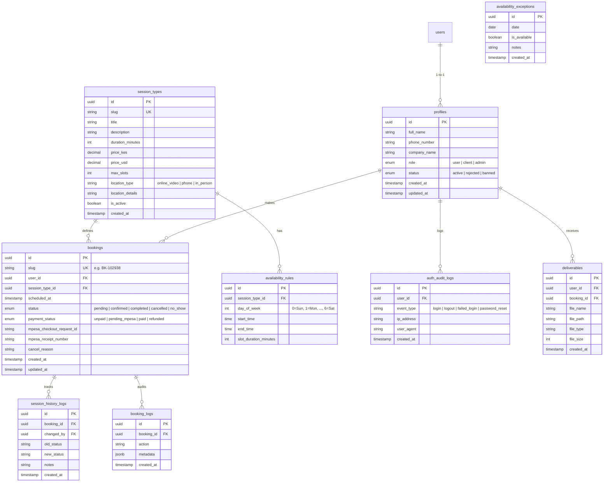

# Implementation Plan - Full Supabase Backend & Dashboard for AI Automation Booking (cillah.dev)

Adapt the booking system architecture from class to Cheryl Cilla Atulah's AI Automation Agency website (`cillah.dev`). Replace Airtable with a scalable Supabase backend (PostgreSQL database, Auth, Storage, Edge Functions) and add full Client and Admin portals with live M-Pesa Daraja payment processing.

---

## 1. Airtable vs. Supabase Architectural Decision

> [!IMPORTANT]
> **Decision:** Move 100% to **Supabase**

| Criteria | Airtable | Supabase (PostgreSQL) | Benefit for cillah.dev |
| :--- | :--- | :--- | :--- |
| **Auth & Security** | No native end-user auth or fine-grained access | Native JWT Auth & Row Level Security (RLS) policies | Clients only see their own bookings; Admin has protected full access. |
| **Scalability & Cost** | Strict rate limits (5 req/sec), high per-seat cost | Scalable PostgreSQL database with zero per-seat fees | Handles high lead spikes & payment webhooks without throttling. |
| **Payment Integration** | Requires third-party webhooks/Zapier middleware | Native API Routes / Supabase Edge Functions | Instant M-Pesa STK Push triggers & secure callback handling. |
| **Media & Assets** | Restricted attachment storage & link expiration | Supabase Storage Buckets with RLS policies | Secure hosting for client deliverables, audit reports, and media. |

---

## 2. Adaptation to cillah.dev (AI Automation Business)

In contrast to fitness training sessions, the system for `cillah.dev` supports high-value consulting and automation service sessions:

1. **Free Automation Audit (30 min):** Discovery call to identify manual operational bottlenecks in client workflows ($0).
2. **1-on-1 Strategy & Architecture Call (60 min):** Deep-dive session designing custom AI agents, CRM syncs, and workflow automations (Paid via M-Pesa).
3. **Retainer Sync & VIP Sprint Kickoff:** Ongoing client status updates and project milestones.

### User Roles & Transition Rules
- **`user`**: Default role assigned automatically upon registration.
- **`client`**: Automatically promoted from `user` when their first session booking is created and payment is confirmed.
- **`admin`**: System administrator (Cheryl Cilla Atulah) with access to full admin dashboard, dynamic session types CRUD, slot availability management, system history, reporting, and user status controls (`active`, `rejected`, `banned`).

---

## 3. Database Schema (Supabase PostgreSQL)



---

## 4. UI/UX & Page Architecture

- **Branding:** Dark mode SaaS theme (`#0F172A` Slate background, `#06B6D4` Cyan glow accents, Geist/Inter typography).
- **Toast Notifications:** Configured to display on the top-left using `sonner` (`<Toaster position="top-left" />`).
- **Navigation Pattern:** Unique URL slugs for detail views (e.g. `/client/bookings/bk-102938`, `/admin/clients/usr-98213`), using modals **exclusively** for quick confirmations and inline field edits.

### File Structure Map

```
/app
├── (auth)/
│   ├── login/page.tsx               # User & Admin Login with Audit Logger
│   ├── signup/page.tsx              # User Registration
│   ├── profile/page.tsx             # User Profile & Security Settings
│   └── logout/route.ts              # Session Termination
├── client/
│   ├── dashboard/page.tsx           # Client Portal Dashboard (Upcoming sessions, action items)
│   ├── bookings/
│   │   ├── page.tsx                 # Client Bookings List & Filter
│   │   └── [slug]/page.tsx          # Unique slug page for specific booking details & cancellation
│   └── deliverables/page.tsx        # Client Shared Media & Documentation (Supabase Buckets)
├── admin/
│   ├── dashboard/page.tsx           # Admin Overview (Metrics, Next Sessions, Recent Bookings)
│   ├── sessions/
│   │   ├── page.tsx                 # Session Types CRUD Table & Slot Generator
│   │   └── availability/page.tsx    # Calendar Availability Rules & Exceptions Manager
│   ├── bookings/
│   │   ├── page.tsx                 # Admin Booking Management (Filter, Status Update, Reschedule)
│   │   └── [slug]/page.tsx          # Booking Detail & Payment Receipt Audit
│   ├── clients/
│   │   ├── page.tsx                 # Client & User Directory (Role Change, Ban, Reject)
│   │   └── [id]/page.tsx            # Client Profile, History & Notes
│   ├── history/page.tsx             # System Logs (Login History, Session Logs, Booking Logs)
│   ├── reporting/page.tsx           # Revenue Analytics & M-Pesa Transaction Logs
│   └── settings/page.tsx            # Business Profile & M-Pesa Gateway Config
└── api/
    ├── mpesa/
    │   ├── stkpush/route.ts         # Initiates Safaricom Daraja STK Push (Production)
    │   └── callback/route.ts        # Receives Safaricom Daraja Asynchronous Webhook
    └── webhooks/
        └── supabase-auth/route.ts   # Handles post-signup triggers & login history logger
```

---

## 5. M-Pesa Payment Flow (Safaricom Daraja Production API)

1. Client selects a paid session type (e.g., Strategy & Architecture Call) and chooses an available slot.
2. Client inputs their Safaricom phone number in international format (`2547XXXXXXXX`).
3. Web application triggers `POST /api/mpesa/stkpush`.
4. The server generates a timestamped Security Passkey password and requests Safaricom Daraja STK Push endpoint.
5. Safaricom sends instant M-Pesa SIM popup to client's mobile device requesting PIN.
6. Upon PIN entry, Safaricom sends asynchronous payment callback to `/api/mpesa/callback`.
7. Webhook validates `ResultCode == 0`, extracts `MpesaReceiptNumber`, updates booking `payment_status = 'paid'`, sets `status = 'confirmed'`, and auto-promotes user role from `user` to `client`.

---

## 6. Detailed Implementation Steps

### Phase 1: Database Infrastructure & Supabase Client Setup
1. Create SQL Migration file containing table definitions, ENUMs, triggers for automatic `profiles` row creation upon `auth.users` insert, and RLS policies.
2. Setup `@supabase/ssr` or `@supabase/supabase-js` helpers in `lib/supabase/client.ts`, `lib/supabase/server.ts`, and `lib/supabase/middleware.ts`.
3. Configure `Toaster` with `position="top-left"` in root layout.

### Phase 2: Auth & User Profile System
1. Build `app/(auth)/signup/page.tsx` with name, email, phone number, company name.
2. Build `app/(auth)/login/page.tsx` capturing login audit records into `auth_audit_logs`.
3. Build `app/(auth)/profile/page.tsx` for profile updating.

### Phase 3: Admin Portal & Session Management
1. Build `/admin/dashboard/page.tsx` displaying KPI metrics (total bookings, revenue, upcoming sessions, active clients).
2. Build `/admin/sessions/page.tsx` for complete CRUD of session types (Max slots, pricing, location, cancel policy).
3. Build `/admin/sessions/availability/page.tsx` for controlling weekly scheduling rules and blackout exceptions.
4. Build `/admin/clients/page.tsx` & `/admin/clients/[id]/page.tsx` for client directory management and banning/rejecting users.
5. Build `/admin/history/page.tsx` with tabbed views for Auth Logs, Session History Logs, and Booking Logs.
6. Build `/admin/reporting/page.tsx` with M-Pesa transaction analytics.

### Phase 4: Client Portal & Booking Management
1. Build `/client/dashboard/page.tsx` for client session overview and quick actions.
2. Build `/client/bookings/page.tsx` listing all active and historical bookings.
3. Build `/client/bookings/[slug]/page.tsx` for detailed session view, location link, and cancellation modal with reason capture.
4. Build `/client/deliverables/page.tsx` for accessing shared audit documents and strategy assets.

### Phase 5: M-Pesa Daraja Integration & Webhooks
1. Implement `app/api/mpesa/stkpush/route.ts` with OAuth token retrieval & production payload.
2. Implement `app/api/mpesa/callback/route.ts` handling M-Pesa callback payload, receipt recording, status transition, and role elevation.

---

## 7. Verification Plan

### Automated Type & Build Verification
- Execute `npm run build` to verify TypeScript types, route handlers, and Next.js page generation without errors.

### Manual Functional Verification
1. **User Registration & Auth Audit:** Register a new user, log in, verify `auth_audit_logs` record created, check initial role is `user`.
2. **Admin Session CRUD:** Log in as admin, create a custom Session Type (e.g. "VIP AI Architecture Sprint"), define weekly availability rules and blackout exceptions.
3. **Client Booking & M-Pesa STK Push:** Select session slot as client, enter Safaricom phone number, trigger STK Push, verify receipt, confirm booking status changes to `confirmed` and role elevates to `client`.
4. **User Status Management:** Test admin banning/rejecting a user and confirm RLS blocks unauthorized dashboard access.
5. **Toast Placement:** Verify all feedback messages render at the top-left screen position.

---

## 8. Environment Variables (`.env` Specification)

Below is the complete list of environment variables required to run `cillah.dev` with full Supabase, Auth, M-Pesa Daraja, and notification integration.

### Environment Variables Summary Table

| Variable Name | Environment Scope | Secret / Public | Description |
| :--- | :--- | :--- | :--- |
| `NEXT_PUBLIC_APP_URL` | Client & Server | Public | Base application URL (e.g. `https://cillah.dev` or `http://localhost:3000`). |
| `NEXT_PUBLIC_SUPABASE_URL` | Client & Server | Public | Supabase Project URL (`https://hastygfosgyxrxzrzrur.supabase.co`). |
| `NEXT_PUBLIC_SUPABASE_ANON_KEY` | Client & Server | Public | Supabase Client Anonymous API key (enforces RLS). |
| `SUPABASE_SERVICE_ROLE_KEY` | Server Only | **Secret** | Supabase Service Role key (bypasses RLS for role elevation & webhooks). |
| `MPESA_ENVIRONMENT` | Server Only | Secret | Daraja environment (`production` or `sandbox`). |
| `MPESA_CONSUMER_KEY` | Server Only | **Secret** | Safaricom Daraja Consumer Key. |
| `MPESA_CONSUMER_SECRET` | Server Only | **Secret** | Safaricom Daraja Consumer Secret. |
| `MPESA_SHORTCODE` | Server Only | Secret | Business Shortcode / Paybill Number (e.g. `174379` for sandbox or live Paybill). |
| `MPESA_PASSKEY` | Server Only | **Secret** | Lipa Na M-Pesa Online STK Push Passkey. |
| `MPESA_CALLBACK_URL` | Server Only | Secret | Webhook URL for M-Pesa callbacks (`https://cillah.dev/api/mpesa/callback`). |
| `RESEND_API_KEY` | Server Only | **Secret** | Resend API Key for sending transactional booking emails. |
| `NOTIFICATION_EMAIL_FROM` | Server Only | Secret | Sender address for transactional emails (e.g. `Cheryl <cheryl@cillah.dev>`). |
| `ADMIN_NOTIFICATION_EMAIL` | Server Only | Secret | Admin email address for receiving instant booking alerts. |

---

### Ready-to-Copy `.env.example` Block

```env
# ==============================================================================
# 1. CORE APPLICATION CONFIGURATION
# ==============================================================================
NEXT_PUBLIC_APP_URL=http://localhost:3000

# ==============================================================================
# 2. SUPABASE BACKEND (Project ID: hastygfosgyxrxzrzrur)
# ==============================================================================
NEXT_PUBLIC_SUPABASE_URL=https://hastygfosgyxrxzrzrur.supabase.co
NEXT_PUBLIC_SUPABASE_ANON_KEY=your_supabase_anon_key_here
SUPABASE_SERVICE_ROLE_KEY=your_supabase_service_role_key_here

# ==============================================================================
# 3. SAFARICOM M-PESA DARAJA API
# ==============================================================================
MPESA_ENVIRONMENT=production
MPESA_CONSUMER_KEY=your_daraja_consumer_key_here
MPESA_CONSUMER_SECRET=your_daraja_consumer_secret_here
MPESA_SHORTCODE=your_business_shortcode_here
MPESA_PASSKEY=your_lipa_na_mpesa_passkey_here
MPESA_CALLBACK_URL=https://cillah.dev/api/mpesa/callback

# ==============================================================================
# 4. TRANSACTIONAL EMAIL NOTIFICATIONS (Resend)
# ==============================================================================
RESEND_API_KEY=re_your_resend_api_key_here
NOTIFICATION_EMAIL_FROM="Cheryl Cilla Atulah <cheryl@cillah.dev>"
ADMIN_NOTIFICATION_EMAIL="cheryl@cillah.dev"

# ==============================================================================
# 5. ANALYTICS & EMBEDS (OPTIONAL)
# ==============================================================================
NEXT_PUBLIC_CALENDLY_URL=https://calendly.com/your-calendly-link
NEXT_PUBLIC_GA_MEASUREMENT_ID=G-XXXXXXXXXX
NEXT_PUBLIC_META_PIXEL_ID=XXXXXXXXXXXXXXX
```

